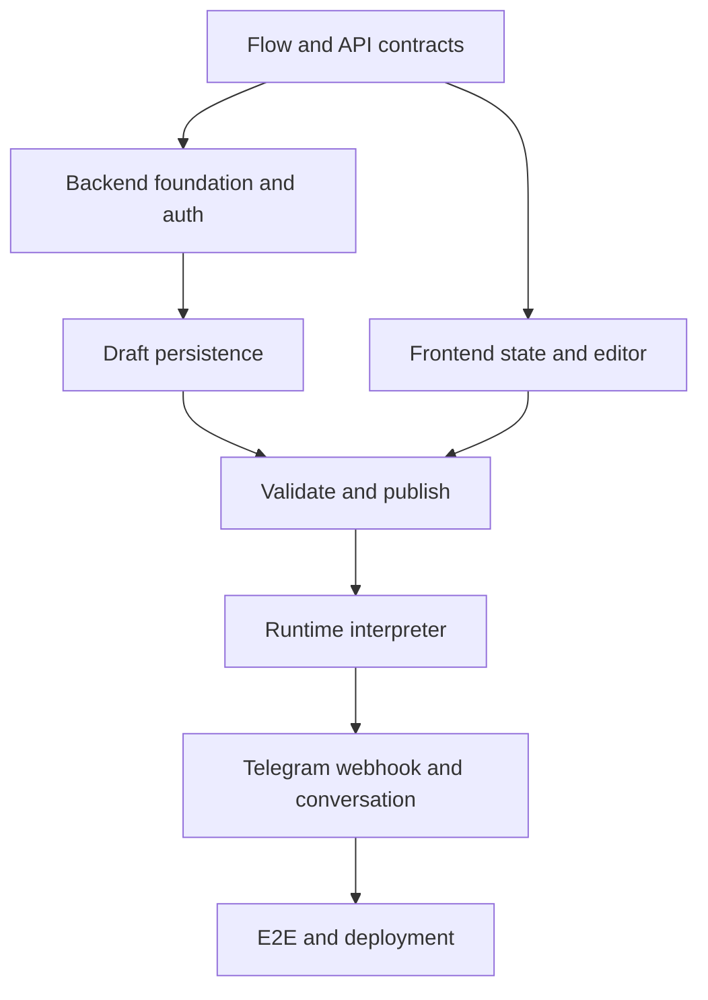

# MVP Development Backlog — Telegram Bot Builder

**Статус:** implementation-ready backlog  
**Базова архітектура:** TypeScript/React frontend + Java/Spring Boot modular monolith + PostgreSQL  
**Команда:** один developer  
**Мета:** реалізувати наскрізний сценарій `Management Bot → Mini App → Draft → Publish → User Bot → Start → SendMessage → Button branch`.

## 1. Зафіксовані технічні рішення

Цей backlog виходить із таких рішень:

- `bot-builder-ui` стає чистим frontend repository: React, TypeScript, Vite, React Flow, Zustand;
- `BotConstructor` містить Java REST API, management bot, persistence і shared multi-tenant runtime;
- frontend зберігає поточний editable state як TypeScript objects у Zustand;
- autosave серіалізує `FlowDraft` у JSON і зберігає його через REST;
- PostgreSQL зберігає mutable draft у `JSONB` і immutable published versions;
- `Save` не запускає runtime і не створює окремий process/container;
- `Publish` створює immutable executable version і перемикає `Bot.activeFlowVersionId`;
- Telegram доставляє updates через webhook у той самий Java application;
- runtime інтерпретує published flow, а не генерує source code;
- conversation state зберігається у PostgreSQL і прив'язується до конкретної `FlowVersion`;
- для першого vertical slice дозволена синхронна обробка webhook;
- перед public beta додається PostgreSQL inbox/outbox у тому самому Java application;
- Kafka, Redis, Kubernetes, Python runtime і Node.js backend у MVP не використовуються.

## 2. Межі MVP

### У MVP входить

- Telegram management bot із кнопкою відкриття Mini App;
- Telegram `initData` authentication;
- default workspace і мінімальна tenant isolation;
- створення та перегляд користувацьких ботів;
- введення, перевірка, шифрування і заміна bot token;
- visual editor для `Start`, `SendMessage` та inline buttons;
- branches від кнопок;
- draft load/save/autosave;
- optimistic locking через revision/ETag;
- server-side flow validation;
- immutable publish і active version;
- Telegram webhook user-created bot runtime;
- conversation state і version pinning;
- idempotency вхідних Telegram updates;
- logs, health, basic metrics, backup і Docker Compose;
- один production-like E2E scenario.

### У MVP не входить

- Payment, Broadcast, arbitrary HTTP calls, custom code і plugins;
- складні conditions, variables та цикли без очікування user input;
- collaboration і realtime editing;
- генерація source code або container per bot;
- окремий runtime service;
- Kafka, Redis, Kubernetes або service mesh;
- Python/Flask production backend;
- Node.js backend;
- повний billing engine, analytics і marketplace templates;
- offline-first editor і складне merge кількох draft versions.

## 3. Milestones

| Milestone | Результат | Release gate |
|---|---|---|
| M0 — Contract baseline | Flow schema, OpenAPI, ADR і golden fixtures зафіксовані | Frontend/backend можуть незалежно працювати з одним contract |
| M1 — Auth and bot control plane | Mini App authentication, workspace, bot і token onboarding працюють | Користувач бачить тільки власні bots; token не витікає |
| M2 — Persistent editor | React editor завантажує і autosave-ить draft у PostgreSQL | Refresh не втрачає збережений flow; conflict обробляється |
| M3 — Publish | Backend валідує і створює immutable `FlowVersion` | Invalid flow не публікується; active version перемикається атомарно |
| M4 — Runtime vertical slice | `/start` і button callback виконують published flow | Conversation відновлюється після restart; duplicate update не виконується повторно |
| M5 — Public MVP | Inbox/outbox, deployment, observability, backup і E2E готові | Staging release checklist пройдено |

## 4. Backlog

Оцінки наведені у focused developer-days для одного developer і не включають очікування зовнішніх доступів, review або hosting approval.

### Phase 0 — Architecture and contracts

| ID | Repository | Задача | Dependencies | Estimate | Результат / acceptance criteria |
|---|---|---|---|---:|---|
| ARC-01 | docs/both | Зафіксувати MVP scope і node set | — | 0.5–1 d | Підтверджено `Start`, `SendMessage`, inline buttons; Payment/Broadcast/advanced nodes поза MVP |
| ARC-02 | docs/both | Затвердити ADR для stack, repository boundaries і runtime model | ARC-01 | 0.5–1 d | Письмово зафіксовано React/TS + Java + PostgreSQL, modular monolith, shared interpreter, no Kafka/Python/Node backend |
| CON-01 | BotConstructor | Описати `FlowDraft v1` JSON Schema | ARC-01 | 1–2 d | Schema містить stable node/edge/port/button IDs, layout metadata і `schemaVersion`; Drawflow format не використовується |
| CON-02 | BotConstructor | Описати `ExecutableFlow v1` і node registry | CON-01 | 1–2 d | Визначено runtime config `Start`/`SendMessage`, transitions, button ports, suspend/resume semantics |
| CON-03 | BotConstructor | Зафіксувати graph rules | CON-01 | 1–2 d | Визначено entry node, orphan/invalid edge rules, connected-button deletion, duplicate IDs, cycle policy |
| CON-04 | BotConstructor | Створити golden flow fixtures | CON-01, CON-02, CON-03 | 1–2 d | Є valid branch flow, invalid orphan/port flow, duplicate-ID flow і expected executable output |
| API-01 | BotConstructor | Створити OpenAPI v1 skeleton | ARC-02 | 2–3 d | Описані auth, workspace, bots, credentials, draft, validate, publish, versions, status, health і common errors |
| API-02 | BotConstructor | Налаштувати contract validation і frontend code generation | CON-01, API-01 | 1–2 d | CI перевіряє OpenAPI/JSON Schema; frontend client/types генеруються pinned command без ручного дублювання DTO |

**Phase 0 exit criteria:** frontend і backend мають один узгоджений flow/API contract; невідомі правила button/port більше не блокують код.

### Phase 1 — Java backend foundation

| ID | Repository | Задача | Dependencies | Estimate | Результат / acceptance criteria |
|---|---|---|---|---:|---|
| BE-01 | BotConstructor | Перевести application на підтримуваний Java/Spring baseline без preview | ARC-02 | 2–4 d | Build працює без preview flags; dependency versions зафіксовані; application стартує |
| BE-02 | BotConstructor | Побудувати modular monolith package/module structure | BE-01 | 2–3 d | Є modules `identity`, `workspace`, `bot`, `flow`, `runtime`, `telegram`, `audit`; заборонені залежності перевіряються architecture test |
| BE-03 | BotConstructor | Додати profiles і typed configuration | BE-01 | 1–2 d | Окремі `local/test/prod`; secrets не мають defaults і не комітяться; startup fail-fast при відсутніх prod settings |
| DB-01 | BotConstructor | Додати Flyway і baseline migration | BE-01 | 1–2 d | Порожня PostgreSQL піднімається міграціями; Hibernate працює в `validate`, а не створює schema |
| DB-02 | BotConstructor | Створити User/Workspace/Membership/Bot schema | DB-01, CON-01 | 2–4 d | Tenant ownership заданий FK/constraints; є indexes; integration test запускається через Testcontainers |
| BE-04 | BotConstructor | Реалізувати common REST error format | API-01, BE-01 | 1–2 d | Усі помилки мають `code`, `message`, `traceId`, `fieldErrors`; stack trace не повертається client |
| BE-05 | BotConstructor | Додати OpenAPI-driven DTO mapping | API-01, BE-02 | 1–3 d | Controllers не повертають JPA entities; compile/test виявляє contract drift |
| TEST-01 | BotConstructor | Налаштувати backend test foundation | BE-01, DB-01 | 2–3 d | JUnit, Testcontainers, migration test, REST integration test і architecture test запускаються однією Maven command |

**Phase 1 exit criteria:** backend стартує локально, міграції працюють, tenant base schema і test foundation готові.

### Phase 2 — Authentication, workspace and bot onboarding

| ID | Repository | Задача | Dependencies | Estimate | Результат / acceptance criteria |
|---|---|---|---|---:|---|
| AUTH-01 | BotConstructor | Реалізувати Telegram Mini App `initData` verification | BE-04, DB-02 | 2–4 d | Перевіряються signature/hash, `auth_date`, replay window; forged/expired data відхиляються; raw initData не логується |
| AUTH-02 | BotConstructor | Реалізувати коротку platform session | AUTH-01 | 2–3 d | Auth endpoint повертає short-lived token; frontend не зберігає його у localStorage; expiry/refresh behavior визначено |
| AUTH-03 | BotConstructor | Створювати User і default Workspace під час першого входу | AUTH-01, DB-02 | 2–3 d | Повторний login idempotent; Telegram user не створює дубль; default membership існує |
| AUTH-04 | BotConstructor | Реалізувати tenant authorization policy | AUTH-02, AUTH-03 | 2–4 d | Кожен bot/flow query scoped by workspace; cross-tenant REST integration tests повертають deny/not found |
| BOT-01 | BotConstructor | Реалізувати Bot CRUD для MVP | AUTH-04, API-01 | 2–4 d | Create/list/get/update доступні owner; create підтримує `Idempotency-Key`; token у DTO відсутній |
| SEC-01 | BotConstructor | Реалізувати encryption port для bot token | BE-03, BOT-01 | 2–4 d | Token encrypted at rest; key не зберігається в DB; token не потрапляє у logs/errors/API responses |
| BOT-02 | BotConstructor | Реалізувати token verification через Telegram `getMe` | SEC-01 | 2–4 d | Невалідний token не зберігається; Telegram bot id/username збережено; network errors відрізняються від invalid token |
| BOT-03 | BotConstructor | Реалізувати `setWebhook` для user-created bot | BOT-02 | 2–4 d | Webhook URL не містить token; per-bot secret configured; replacement/reconnect idempotent |
| MGT-01 | BotConstructor | Refactor management bot як Telegram adapter | AUTH-03 | 2–4 d | `/start` повертає кнопку Mini App; business logic викликається in-process; production не використовує long polling |

**Phase 2 exit criteria:** користувач входить із Telegram, бачить тільки свої bots, безпечно підключає token і отримує зареєстрований webhook.

### Phase 3 — Frontend foundation and editor state

| ID | Repository | Задача | Dependencies | Estimate | Результат / acceptance criteria |
|---|---|---|---|---:|---|
| FE-01 | bot-builder-ui | Створити React + strict TypeScript + Vite application | ARC-02 | 1–2 d | Build/lint/typecheck/Vitest проходять; vanilla entrypoint більше не є production entrypoint |
| FE-02 | bot-builder-ui | Створити frontend module structure | FE-01 | 1–2 d | Є `app`, `features/auth`, `features/bots`, `features/editor`, `entities/flow`, `shared/api`, `shared/telegram` |
| FE-03 | bot-builder-ui | Підключити generated OpenAPI client і flow types | API-02, FE-01 | 1–2 d | Ручні API DTO відсутні; contract version pinned; generation reproducible |
| FE-04 | bot-builder-ui | Реалізувати Telegram SDK adapter і browser dev mode | FE-02 | 1–3 d | Mini App ready/expand/theme працюють; локально можна використовувати mock initData без Telegram |
| FE-05 | bot-builder-ui | Реалізувати auth bootstrap | FE-03, FE-04, AUTH-02 | 2–4 d | `initData` відправляється один раз; session token у memory; invalid/expired auth має зрозумілий UX |
| FE-06 | bot-builder-ui | Реалізувати bots list/create/select | FE-03, FE-05, BOT-01 | 2–4 d | Користувач створює й відкриває bot; loading/empty/error states реалізовані |
| FE-07 | bot-builder-ui | Реалізувати token onboarding form | FE-06, BOT-02, BOT-03 | 2–4 d | Token не потрапляє в localStorage/logging; UI показує verified bot username або безпечну помилку |
| FE-08 | bot-builder-ui | Створити canonical Zustand `FlowEditorStore` | CON-01, FE-02 | 3–5 d | Нормалізовані nodes/edges; commands add/update/delete/connect/reorder покриті unit tests; DOM не є state |
| FE-09 | bot-builder-ui | Створити React Flow adapter у controlled mode | FE-08 | 3–5 d | React Flow отримує nodes/edges зі store; drag/connect callbacks оновлюють store; node не recreate-иться при edit |
| FE-10 | bot-builder-ui | Реалізувати `Start` і `SendMessage` visual nodes | FE-09 | 3–5 d | Stable node/port IDs; Start один; node type/config відображаються без raw mutable HTML |
| FE-11 | bot-builder-ui | Реалізувати node configuration panel | FE-08, FE-10 | 3–5 d | Text editing, selection, delete і validation працюють; зміни одразу відображаються на canvas |
| FE-12 | bot-builder-ui | Реалізувати inline buttons і branch ports | FE-11, CON-03 | 3–6 d | Add/edit/delete/reorder зберігають stable button/port IDs; connected delete виконується за затвердженим правилом |
| FE-13 | bot-builder-ui | Реалізувати dirty state і unsaved-changes UX | FE-08 | 1–2 d | Зміни ставлять `isDirty`; успішний save очищає; закриття/перехід попереджає про unsaved state де це підтримується |

**Phase 3 exit criteria:** editor має єдиний state у Zustand і стабільно будує `Start → SendMessage → button branches` без localStorage як canonical storage.

### Phase 4 — Draft persistence, autosave and publish

| ID | Repository | Задача | Dependencies | Estimate | Результат / acceptance criteria |
|---|---|---|---|---:|---|
| FLOW-01 | BotConstructor | Додати `flow_draft` migration і repository | DB-02, CON-01 | 2–3 d | Один mutable draft per bot; `definition_json JSONB`, `schema_version`, `revision`, audit timestamps |
| FLOW-02 | BotConstructor | Реалізувати GET/PUT draft API | FLOW-01, API-01, AUTH-04 | 3–5 d | Load/save працюють; workspace scope enforced; PUT перевіряє JSON Schema і current revision |
| FLOW-03 | BotConstructor | Реалізувати optimistic locking/ETag | FLOW-02 | 1–3 d | Correct revision збільшується; stale revision повертає `412 Precondition Failed`; silent overwrite неможливий |
| FE-14 | bot-builder-ui | Реалізувати draft hydration | FE-08, FLOW-02 | 2–3 d | GET draft перетворюється у store; loading/invalid-schema/migration errors відображаються |
| FE-15 | bot-builder-ui | Реалізувати debounced autosave і manual Save | FE-13, FE-14, FLOW-03 | 3–5 d | Autosave після 1–3 s inactivity; node position saves after drag stop; Save flushes immediately; UI показує saving/saved/error |
| FE-16 | bot-builder-ui | Реалізувати revision conflict UX | FE-15 | 2–4 d | `412` не перезаписує server state; користувач може reload latest або зберегти локальну копію; conflict видимий |
| FLOW-04 | BotConstructor | Реалізувати domain graph validator | CON-03, FLOW-02 | 3–5 d | Перевіряються start count, reachable nodes, node config, ports, button edges, unsupported type, unsafe cycles |
| FLOW-05 | BotConstructor | Реалізувати deterministic compiler Draft → ExecutableFlow | CON-02, FLOW-04 | 3–5 d | Однаковий draft дає однаковий executable JSON/checksum; editor layout не впливає на execution |
| FLOW-06 | BotConstructor | Додати `flow_version` і active version migrations | FLOW-01 | 2–3 d | Published version immutable; `(bot_id, version_number)` unique; Bot має nullable `active_flow_version_id` |
| FLOW-07 | BotConstructor | Реалізувати validate/publish transaction | FLOW-05, FLOW-06 | 3–6 d | Publish повторно server-validates, compiles, створює next version і атомарно активує її; `Idempotency-Key` підтриманий |
| FLOW-08 | BotConstructor | Реалізувати versions/list/get/activate rollback API | FLOW-07 | 2–4 d | Старі versions read-only; owner може активувати сумісну version; audit event записується |
| FE-17 | bot-builder-ui | Реалізувати Validate/Publish/version status UI | FE-03, FLOW-07, FLOW-08 | 3–5 d | Validation errors прив'язані до node/field; Publish flushes pending autosave; active version видима |

**Phase 4 exit criteria:** draft переживає refresh, autosave не створює конфліктів непомітно, а publish створює immutable executable version без deployment нового process.

### Phase 5 — Shared Telegram runtime

| ID | Repository | Задача | Dependencies | Estimate | Результат / acceptance criteria |
|---|---|---|---|---:|---|
| RT-01 | BotConstructor | Створити runtime domain interfaces | CON-02, FLOW-05 | 2–3 d | Є ports `FlowLoader`, `ConversationStore`, `TelegramSender`, `NodeExecutor`; runtime не залежить від REST controllers/JPA entities |
| RT-02 | BotConstructor | Реалізувати interpreter loop | RT-01 | 3–6 d | Runtime переходить між nodes deterministically; має transition budget; suspend/complete/fail states тестуються |
| RT-03 | BotConstructor | Реалізувати `Start` executor | RT-02 | 1–2 d | `/start` створює/reset conversation за визначеним правилом і переходить у first executable node |
| RT-04 | BotConstructor | Реалізувати `SendMessage` executor | RT-02 | 2–4 d | Text і inline keyboard mapping коректні; unsupported/missing config fail safely |
| RT-05 | BotConstructor | Реалізувати button wait/resume/branch | RT-04 | 3–5 d | Callback stable button ID знаходить transition; unknown/stale callback безпечно відхиляється; callback acknowledged |
| RT-06 | BotConstructor | Створити Conversation/ConversationState schema | DB-01, FLOW-06 | 2–4 d | Key включає bot/chat; state містить pinned flow version, current/waiting node, variables JSONB, status і row version |
| RT-07 | BotConstructor | Реалізувати conversation repository і locking | RT-06 | 2–4 d | State переживає restart; concurrent updates одного chat серіалізуються; різні bots/chats не блокують один одного |
| TG-01 | BotConstructor | Реалізувати current Telegram Bot API adapter | BOT-02, RT-01 | 2–4 d | `sendMessage` і `answerCallbackQuery` працюють через per-bot credential; timeouts/errors mapped; secrets redacted |
| TG-02 | BotConstructor | Реалізувати per-bot webhook controller/routing | BOT-03, RT-02, RT-06 | 3–5 d | Route знаходить bot без token у URL; webhook secret перевіряється; invalid/disabled bot відхиляється |
| RT-08 | BotConstructor | Додати inbound update idempotency | TG-02 | 2–3 d | Unique `(bot_id, telegram_update_id)`; duplicate update не виконує flow і не відправляє повторно message у нормальному retry path |
| RT-09 | BotConstructor | Підключити синхронний webhook execution vertical slice | RT-03–RT-08, TG-01 | 2–4 d | Webhook виконує simple flow in-process і повертає контроль у межах timeout; errors/status/logs зрозумілі |
| RT-10 | BotConstructor | Додати PostgreSQL inbox worker перед public beta | RT-09 | 3–6 d | Webhook durable-inserts update і швидко повертає 200; worker claim-ить batch через locking; retry/backoff/status реалізовані |
| RT-11 | BotConstructor | Додати PostgreSQL Telegram outbox | RT-10, TG-01 | 3–6 d | Outbound commands persistent; retryable/terminal errors розрізняються; stuck/failed messages видимі; retention визначена |
| RT-12 | BotConstructor | Реалізувати version pinning policy | RT-06, FLOW-08 | 2–3 d | Нова conversation використовує active version; існуюча продовжує pinned version; rollback не ламає active conversations |
| TEST-02 | BotConstructor | Створити runtime unit/integration test suite | RT-02–RT-12 | 3–6 d | Покрито `/start`, branch, duplicate update, stale callback, restart, concurrent updates, publish v2 while v1 conversation active |

**Phase 5 exit criteria:** shared runtime виконує опублікований flow для багатьох bot tokens, зберігає conversation state і не запускає окремі processes per bot.

### Phase 6 — End-to-end, deployment and MVP hardening

| ID | Repository | Задача | Dependencies | Estimate | Результат / acceptance criteria |
|---|---|---|---|---:|---|
| E2E-01 | Both | Реалізувати golden E2E test/smoke script | FE-17, RT-09 | 3–5 d | Management bot → Mini App auth → create bot → token → draft → publish → `/start` → button branch працює |
| OPS-01 | BotConstructor | Створити production Dockerfile | BE-01 | 1–2 d | Non-root image, health check, no source/secrets, reproducible build |
| OPS-02 | Both | Створити Docker Compose local topology | OPS-01, FE-01, DB-01 | 2–3 d | Однією command піднімаються PostgreSQL, Java app і static frontend/reverse proxy; migrations застосовуються |
| OPS-03 | Both | Налаштувати Caddy/Nginx routing і HTTPS topology | OPS-02 | 1–3 d | `/api` і Telegram webhooks ідуть у Java; frontend routes повертають SPA; production URL plan задокументований |
| CI-01 | bot-builder-ui | Додати frontend CI | FE-03, FE-12 | 1–2 d | Install, contract generation check, lint, typecheck, unit/component tests і build проходять на PR |
| CI-02 | BotConstructor | Додати backend CI | TEST-01, TEST-02 | 1–2 d | Maven verify, migrations, contract validation, integration/architecture tests і image build проходять на PR |
| OBS-01 | BotConstructor | Додати structured logging і correlation IDs | BE-04, TG-02 | 2–3 d | Логи містять trace/update/bot public IDs, але не token/initData/message secrets; runtime outcome searchable |
| OBS-02 | BotConstructor | Додати health/readiness і basic metrics | RT-10, RT-11 | 2–4 d | DB/worker readiness, update count/latency/failures, inbox/outbox backlog і Telegram errors доступні |
| OPS-04 | BotConstructor | Додати backup/restore procedure | DB-01 | 1–3 d | Автоматичний backup налаштований; test restore виконаний; retention і відповідальний визначені |
| SEC-02 | Both | Виконати MVP security hardening | AUTH-04, BOT-03, FE-17 | 3–6 d | CORS allowlist, CSRF decision, rate limits, security headers, tenant negative tests, XSS checks, secret scanning пройдені |
| QA-01 | Both | Провести failure/recovery testing | RT-10, RT-11, OBS-02 | 2–4 d | Перевірено restart Java/DB, duplicate webhook, Telegram timeout/429/5xx, stuck update, invalid version і recovery |
| REL-01 | Both/docs | Підготувати staging і release runbook | E2E-01, OPS-03, OBS-02, OPS-04, SEC-02 | 2–4 d | Описані deploy, migration, setWebhook, rollback, token rotation, backup restore, known limitations і support diagnostics |

**Phase 6 exit criteria:** продукт розгортається повторювано, основний шлях перевірений, updates не губляться після durable acceptance, а developer може діагностувати і відновити систему.

## 5. Critical path

Послідовність critical path:

1. `ARC-01 → CON-01 → CON-02 → CON-03 → API-01`;
2. `BE-01 → DB-01 → DB-02 → AUTH-01 → AUTH-04`;
3. `FLOW-01 → FLOW-02 → FLOW-04 → FLOW-05 → FLOW-07`;
4. паралельний logical track `FE-01 → FE-08 → FE-09 → FE-12 → FE-15 → FE-17`;
5. `RT-01 → RT-02 → RT-04 → RT-05 → RT-06 → TG-02 → RT-09`;
6. `E2E-01 → RT-10 → RT-11 → OBS-02 → REL-01`.

Для одного developer це виконується послідовно, навіть якщо окремі задачі технічно допускають паралельну роботу.

## 6. Перші задачі у фактичному порядку

Не починати з повного переписування frontend. Перші десять задач:

1. `ARC-01` — затвердити точний MVP node set.
2. `CON-01` — створити `FlowDraft v1` JSON Schema.
3. `CON-03` — затвердити button/port/delete/cycle rules.
4. `CON-02` — створити `ExecutableFlow v1`.
5. `CON-04` — створити golden JSON fixtures.
6. `API-01` — створити OpenAPI v1 skeleton.
7. `BE-01` — прибрати Java preview і стабілізувати backend baseline.
8. `DB-01` — додати Flyway baseline.
9. `BE-02` — створити modular monolith boundaries.
10. `FE-01` — створити React/TypeScript/Vite foundation.

Після цього виконувати authentication/backend persistence і frontend editor маленькими наскрізними increment-ами.

## 7. Рекомендований delivery порядок

### Increment 1 — Empty authenticated Mini App

- management bot відкриває Mini App;
- backend перевіряє `initData`;
- створюються User і default Workspace;
- frontend показує поточного user та empty bots list.

### Increment 2 — Connected bot

- користувач створює Bot record;
- вводить token;
- backend виконує `getMe`, encrypts token і викликає `setWebhook`;
- frontend показує verified bot username/status.

### Increment 3 — Persistent two-node editor

- frontend створює `Start → SendMessage`;
- Zustand є єдиним editor state;
- draft autosave-иться у PostgreSQL;
- refresh відновлює graph;
- stale revision дає conflict.

### Increment 4 — Publish

- backend повністю валідує graph;
- compiler створює executable model;
- publish створює immutable v1;
- Bot отримує active version;
- frontend показує publish status/errors.

### Increment 5 — Telegram execution

- Telegram webhook приймає `/start`;
- runtime завантажує active version;
- створює conversation, відправляє message/buttons і зберігає wait state;
- callback продовжує pinned flow;
- duplicate update не виконується повторно.

### Increment 6 — Public MVP reliability

- synchronous handling замінюється durable PostgreSQL inbox/outbox;
- додаються retry, metrics, backup, failure tests і release runbook;
- Kafka при цьому не додається.

## 8. Definition of Done для кожної задачі

Задача завершена, якщо:

- код відповідає зафіксованому OpenAPI/JSON Schema;
- unit tests покривають domain rules;
- integration test покриває DB/Telegram boundary, якщо вона змінюється;
- tenant boundary перевірена negative test, якщо задача працює з user data;
- secrets і персональні дані не логуються;
- migration backward-safe або має описаний rollback;
- frontend має loading/error/empty state;
- документація/ADR оновлені, якщо змінилося рішення;
- CI зелений;
- acceptance criteria задачі продемонстровано.

## 9. Оцінка загального обсягу

| Scope | Орієнтовна оцінка для одного developer | Що отримуємо |
|---|---:|---|
| Contract + foundation | 12–20 developer-days | Стабільні contracts, Java/DB/React skeleton |
| Editor save/publish milestone | ще 30–48 developer-days | Auth, bot onboarding, editor, autosave, validation і versions |
| Runtime vertical slice | ще 22–36 developer-days | Реальний user-created bot виконує Start/Message/Button |
| Public MVP hardening | ще 16–28 developer-days | Inbox/outbox, CI/CD, security, observability, backup і runbook |
| Повний public MVP | приблизно 80–132 developer-days | Production-like MVP для перших реальних користувачів |

Це focused development time. Для календарного плану потрібно додати product decisions, debugging, hosting access, Telegram integration uncertainty і резерв 20–30%.

## 10. Рішення, які блокують старт

| Питання | Рекомендований default | Deadline |
|---|---|---|
| Точний набір MVP nodes | `Start`, `SendMessage`, inline buttons | До `CON-01` |
| Видалення connected button | Заборонити без explicit confirmation; потім атомарно видалити button, port і edges | До `CON-03` |
| Цикли | Заборонити automatic cycles у MVP | До `CON-03` |
| BYO token чи Telegram Managed Bots | Почати з BYO token; Managed Bots окремим spike | До `BOT-02` |
| Поведінка `/start` для active conversation | Reset conversation і старт на current active version | До `RT-03` |
| Existing conversation після publish v2 | Залишається pinned до v1 | До `RT-12` |
| Hosting | Один невеликий VPS/managed container + PostgreSQL; HTTPS через Caddy/Nginx | До `OPS-03` |

Жодне з цих питань не вимагає Kafka, Python runtime або окремого service.

## 11. Перший release criterion

MVP можна віддати першому зовнішньому користувачу, коли він без ручного втручання developer може:

1. відкрити Mini App з management bot;
2. пройти Telegram authentication;
3. створити bot record і підключити валідний token;
4. створити `Start → SendMessage → two button branches`;
5. закрити й повторно відкрити Mini App без втрати saved draft;
6. опублікувати version 1;
7. відкрити user-created bot і виконати `/start`;
8. натиснути кнопку та отримати правильну branch response;
9. опублікувати version 2 без знищення version 1;
10. отримати зрозумілу помилку при invalid flow/token;
11. не отримати доступ до bot/flow іншого workspace;
12. пережити restart Java application без втрати draft, versions і conversation state.
